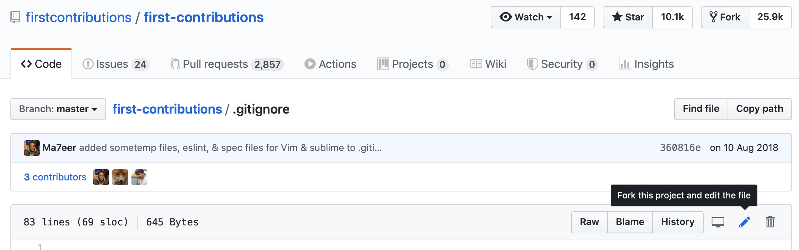

[](https://github.com/ellerbrock/open-source-badges/)
[](https://opensource.org/licenses/MIT)

Oparte na [firstcontributions/first-contributions](https://github.com/firstcontributions/first-contributions/blob/master/translations/README.pl.md)

# Pierwsze kontrybucje

Zawsze jest ciężko, kiedy robisz coś po raz pierwszy. Szczególnie gdy współpracujesz z innymi ludźmi, ponieważ popełnianie błędów nie jest niczym przyjemnym. Jednak właśnie na współpracy opiera się idea otwartego oprogramowania. Chcemy nauczyć w prosty sposób nowych programistów jak wgrać swoją pierwszą zmianę w obcym projekcie.

Czytanie artykułów i oglądanie poradników może pomóc, ale czy jest coś lepszego niż spróbowanie czegoś samemu bez obaw, że się coś zepsuje? Ten projekt ma na celu dostarczyć nowicjuszom wskazówek i uprościć proces wgrania pierwszej zmiany. Pamiętaj: im bardziej się zrelaksujesz, tym lepiej się uczysz. Jeśli chcesz wgrać swoją pierwszą kontrybucję wykonaj kilka prostych kroków poniżej. Będzie fajnie, obiecujemy.

Odróżnijmy najpierw Gita od GitHuba. Git to konsolowy program, za pomocą którego wersjonujemy kod, towrząc repozytoria. GitHub to platforma online, za pomocą której można wymieniać się kodem z innymi. GitHub ma jednak jeszcze wiele innych możliwości.

## Co potrzebujesz?

### Konto na GitHubie

Jeśli go nie masz, to je załóż.

### Git

#### Instalacja w Linuxie

```bash
sudo apt install git
```

#### Instalacja pod MacOS

```bash
brew install git
```

#### Instalacja pod windows

[Pobierz](https://git-scm.com/downloads) i zainstaluj


## Utwórz fork repozytorium

Utwórz fork tego repozytorium klikając przycisk "Fork" na górze tej strony.
Stworzysz tym samym kopie tego repozytorium na swoim koncie.

## Sklonuj repozytorium


Teraz sklonuj repozytorium na swój komputer. Kliknij na przycisk "clone" a później na ikonkę *skopiuj do schowka*.

Otwórz konsolę i uruchom komendę git:

```git
git clone "wklej skopiowany adres"
```

Gdzie "wklej skopiowany adres" (bez cudzysłowia) to adres tego repozytorium. Zobacz poprzedni krok aby skopiować adres.


Przykład:

```git
git clone https://github.com/to-ty/first-contribution.git
```

W miejscu 'to-ty' wstaw swój login na githubie. W tym kroku ściągasz zawartość twojej kopii repozytorium first-contributions z githuba na swój komputer.

## Stwórz gałąź

Wejdź w folder ze swoim repozytorium (jeżeli jeszcze tam nie jesteś):

```bash
cd first-contribution
```

Teraz utwórz nową gałąź wykonując polecenie `git checkout`:

```git
git checkout -b <add-twoj-nick>
```

Przykład

```git
git checkout -b add-kowalski
```

(Nazwa gałęzi nie musi zawierać słowa *add*, ale dobrze jest je dodać z racji tego, że celem tej gałęzi jest dodanie twojego imienia to listy.)

## Wprowadź zmiany i wgraj je

Otwórz plik `Contributors.md` w edytorze tekstu. Jest on zapisany w Markdown, lekkim języku znaczników. Tu masz <a href="https://github.com/adam-p/markdown-here/wiki/Markdown-Cheatsheet">ściągawkę</a> gdzie znajdziesz informację jak używać języka Markdown, ale wcale nie musisz go znać. Zobacz co już zawiera ten plik i wszystko będzie jasne.

Dodaj następującą linię na końcu `Contributors.md`

```md
- [Twój nick z Discorda](https://github.com/Twoja_nazwa_użytkownika)
```

Przykład:

```md
[John Doe](https://github.com/johndoe)
```

Upewnij się że nie ma spacji pomiędzy `](`. Zapisz plik i następnie go zamknij.

Jeżeli wejdziesz w folder ze swoim repozytorium i wykonasz komendę `git status`, zobaczysz, że są tam zmiany. Dodaj te zmiany do właśnie utworzonej gałęzi używając komendy `git add`:

```git
`git add Contributors.md`
```

Jeśli teraz wpiszesz `git status` to dostaniesz informację, że plik Contributors.md został dodany do indexu. Teraz zapisz te zmiany wykonując komendę `git commit`:

```git
git commit -m "Add <twoj-nick> to Contributors list"
```

Zastąp `<twoj-nick>` swoim nickiem.

## Wyślij zmiany na GitHub

Wyślij swoje zmiany komendą `git push`:

```git
git push origin <add-twoj-nick>
```

Zastąp `<add-twoj-nick>` swoją nazwą gałęzi utworzoną wcześniej.

## Wyślij swoje zmiany do zatwierdzenia

W swoim repozytorium na GitHubie znajdziesz przycisk `Compare & pull request`. Kliknij go.


Teraz wyślij prośbę o scalenie.


Niedługo dodam proponowane przez ciebie zmiany do głównej gałęzi projektu. Dostaniesz mailowe powiadomienie, kiedy zmiany zostaną scalone.

## Nie umiem w gita :(

Coś Ci nie wychodzi lub nie wiesz jak zainstalować gita? To wszystko powyżej opisane można też wykonać bez użycia gita. GitHub zapewnia możliwość edytowania plików online. Wystarczy, że klikniesz na ikonę ołówka przy pliku.



Po zapisaniu pliku (commit) wykonaj krok [Wyślij swoje zmiany do zatwierdzenia](#wyślij-swoje-zmiany-do-zatwierdzenia)

## Co dalej?

Możesz teraz zacząc uczestniczyć w innych projektach. Przygotowaliśmy listę projektów z prostymi zadaniami które będą dobre na początek. Sprawdź <a href="https://roshanjossey.github.io/first-contributions/#project-list" rel="nofollow">listę projektów</a>.

### [Materiały dodatkowe](https://github.com/Roshanjossey/first-contributions/blob/master/additional-material/git_workflow_scenarios/additional-material.md)
